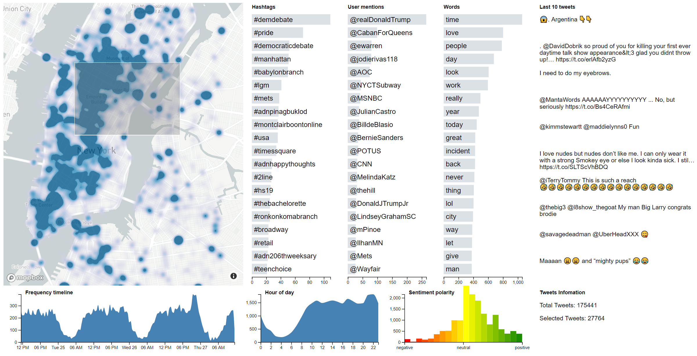

# NYC Twitter Pulse Wall

An interactive visualization tool to explore realtime tweets in New York City. Project developed for Large Scale Visual Analytics course by Enrico Bertini at NYU.

[See live version](http://pmandiola.com/nycpulsewall/)

### Project components:

The server is a Python application running on Docker, and the live version is deployed on Google Cloud Engine. It uses [tweepy](https://github.com/tweepy/tweepy) to listen to geo-tagged real-time tweets from New York City. Tweets are preprocessed by NLP package [spaCy](https://github.com/explosion/spaCy) for lemmatization and [TextBlob](https://github.com/sloria/TextBlob) for sentiment analysis, before being sent to the frontend via websockets.

The frontend is a static site built with [D3js](https://d3js.org/) for visualization and interactions, plus [crossfilter](https://github.com/crossfilter/crossfilter) to support fast filtering with coordinated views. [MapboxGL](https://github.com/mapbox/mapbox-gl-js) is used to visualize tweets on a map in combination with D3js for interaction.
